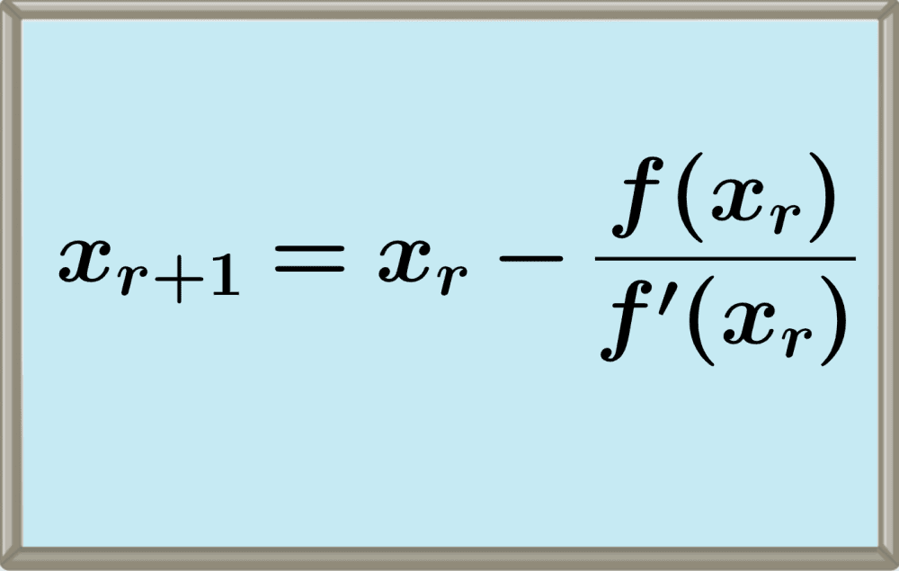

# Newton-Raphson-G-H

Gael Alexandro Silva Huacuja 22310258

Hevan Jesus Viscencio Lopez 22310198

Descripcion:
En este trabajo colaborativo realizaremos un programa en c++ para poder resolver ecuaciones mediante el uso del metodo Newton raphson el cual se basa en una serie de formulas utilizando la primer derivada de la ecuacion.

Funcionalidad:

Documentacion:
